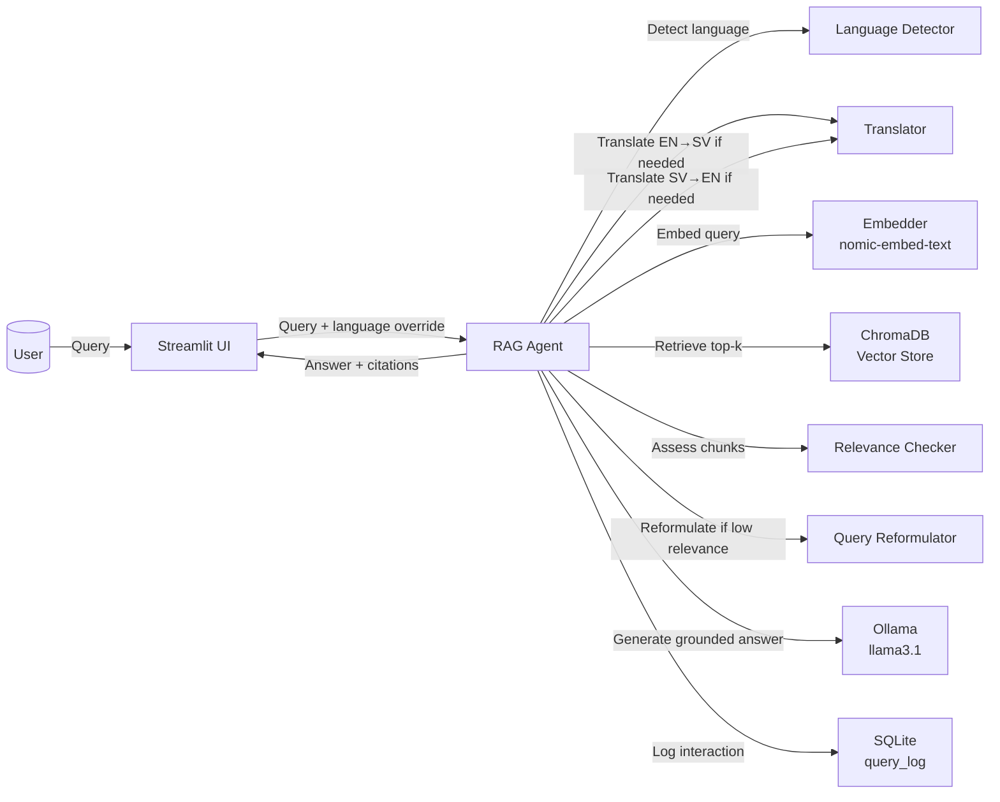

# Migrationsverket RAG Chatbot

A local retrieval-augmented generation system for Swedish immigration questions, built with Ollama, ChromaDB, BeautifulSoup, and Streamlit. All inference and translation runs locally — no external APIs.

## Architecture



## Project overview

This project ingests Swedish Migrationsverket content, stores it in a local ChromaDB vector store, and serves a multilingual RAG chatbot. The pipeline auto-detects query language, translates English queries to Swedish before retrieval, generates answers grounded in Swedish source chunks, then translates the answer back to English if needed. A retry loop with LLM-based relevance checking and query reformulation ensures quality before falling back gracefully.

## Setup

### 1. Prerequisites

- Python 3.11+
- [Ollama](https://ollama.com) installed and running locally

### 2. Pull the required Ollama models

```bash
ollama pull llama3.1
ollama pull nomic-embed-text
```

### 3. Create a virtual environment and install dependencies

```bash
python3.11 -m venv .venv
source .venv/bin/activate
pip install -r requirements.txt
```

### 4. Ingest Migrationsverket content

Run the scraper to crawl and index the website before starting the chatbot:

```python
from migrationsverket_bot.ingestion.scraper import crawl_site
from migrationsverket_bot.ingestion.chunker import chunk_html_by_heading
from migrationsverket_bot.retrieval.embedder import Embedder
from migrationsverket_bot.retrieval.vector_store import VectorStore
import uuid

pages = crawl_site(max_pages=200)
store = VectorStore()
embedder = Embedder()

for page in pages:
    chunks = chunk_html_by_heading(page.get("html", ""))
    for chunk in chunks:
        doc_id = str(uuid.uuid4())
        embedding = embedder.embed_query(chunk["text"])
        store.add_documents(
            ids=[doc_id],
            embeddings=[embedding],
            documents=[chunk["text"]],
            metadatas=[{"url": page["url"], "heading": chunk["heading"]}],
        )
```

### 5. Start the Streamlit app

```bash
streamlit run migrationsverket_bot/ui/app.py
```

## Example queries

- Swedish: `Vilka krav gäller för uppehållstillstånd för arbete?`
- Swedish: `Hur ansöker jag om asyl i Sverige?`
- English: `What documents are needed for family reunification?`
- English: `How do I renew my residence permit from abroad?`

## Cross-lingual RAG architecture

The system uses a **translate → retrieve → generate → translate** pipeline:

1. Detect the incoming query language with `langdetect`.
2. If English, translate the query to Swedish via local Ollama before retrieval.
3. Embed the Swedish query with `nomic-embed-text` and retrieve top-k chunks from ChromaDB.
4. Score retrieved chunks for relevance using the LLM (0–1 scale).
5. If relevance is below threshold, reformulate the query with the LLM and retry (max 2 times).
6. If still low relevance after retries, return a grounded fallback in the user's language.
7. Generate a Swedish answer strictly grounded in the retrieved chunks.
8. If the user requested English output, translate the final answer via Ollama.
9. Cite source URL and section heading with every answer.
10. Log the full interaction (query, language, reformulation, chunks, confidence, latency) to SQLite.

## Repository structure

```
migrationsverket_bot/
├── ingestion/
│   ├── scraper.py          # crawls and scrapes Migrationsverket pages
│   └── chunker.py          # section/heading-based chunking
├── retrieval/
│   ├── embedder.py         # nomic-embed-text via Ollama REST
│   └── vector_store.py     # ChromaDB indexing and retrieval
├── agent/
│   ├── language_detector.py
│   ├── translator.py
│   ├── relevance_checker.py
│   ├── query_reformulator.py
│   └── rag_agent.py        # full pipeline with retry loop
├── evaluation/
│   ├── test_set.json        # 26 Q&A pairs in Swedish and English
│   ├── evaluator.py         # retrieval accuracy, faithfulness, translation quality
│   └── metrics_logger.py    # evaluation results → SQLite
├── observability/
│   └── logger.py            # query interaction logging → SQLite
├── ui/
│   └── app.py               # Streamlit chat + metrics dashboard
├── config.py                # all parameters centralised here
requirements.txt
README.md
```
