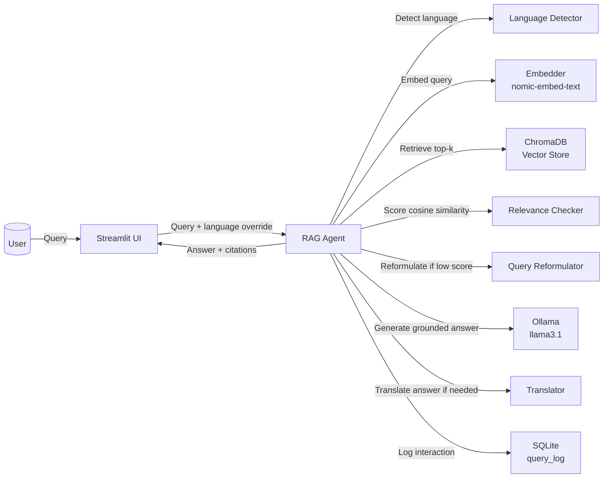

# Migrationsverket RAG

A local RAG chatbot for Swedish immigration questions. Runs entirely on your machine — no API keys, no cloud.

Built for a specific use case: a researcher living and working in Sweden who needs quick answers about permits, renewals, citizenship, and inviting family/friends to visit.

**Stack:** Ollama (llama3.1 + nomic-embed-text), ChromaDB, BeautifulSoup, Streamlit.

## Architecture



## Setup

**Prerequisites:** Python 3.11+, [Ollama](https://ollama.com) running locally.

```bash
ollama pull llama3.1
ollama pull nomic-embed-text

python3.11 -m venv myvenv
source myvenv/bin/activate
pip install -e .
```

## Ingestion

The site has ~4000 pages. `ingest_personal.py` pulls the URL list from the sitemap, filters to ~1100 relevant pages (work permits, researchers, studying, visiting, permanent residency, citizenship), and indexes those. Already-ingested URLs are tracked so re-runs only pick up new pages.

```bash
python ingest_personal.py
```

To start fresh:
```bash
rm -rf migrationsverket_bot/data/chroma
rm -f migrationsverket_bot/data/ingested_urls.json
python ingest_personal.py
```

## Running

```bash
python -m streamlit run migrationsverket_bot/ui/app.py
```

Opens at `http://localhost:8501`. Chat tab for questions, metrics tab for query history, confidence scores, and latency.

## Testing

```bash
python run_tests.py
```

Runs 16 questions covering the main use cases and checks answers against expected keywords.

## Tuning

Everything is in [config.py](migrationsverket_bot/config.py):

| Setting | Default | Effect |
|---|---|---|
| `OLLAMA_MODEL` | `llama3.1` | Swap for `mistral` etc. |
| `EMBEDDING_MODEL` | `nomic-embed-text` | Embedding model |
| `TOP_K` | `5` | Chunks retrieved per query |
| `CONFIDENCE_THRESHOLD` | `0.4` | Cosine similarity cutoff — below this the fallback triggers |
| `RETRY_LIMIT` | `2` | Reformulation attempts before giving up |

## Structure

```
migrationsverket_bot/
├── ingestion/
│   ├── scraper.py          # fetches and parses pages (returns main content HTML)
│   ├── chunker.py          # splits by heading structure
│   └── tracker.py          # tracks ingested URLs to avoid re-indexing
├── retrieval/
│   ├── embedder.py         # batched embeddings via Ollama /api/embed
│   └── vector_store.py     # ChromaDB wrapper
├── agent/
│   ├── language_detector.py
│   ├── translator.py
│   ├── relevance_checker.py   # cosine similarity scoring (no LLM call)
│   ├── query_reformulator.py
│   └── rag_agent.py
├── evaluation/
│   ├── test_set_personal.json   # 16 questions for the researcher use case
│   ├── test_set.json
│   ├── evaluator.py
│   └── metrics_logger.py
├── observability/
│   └── logger.py
├── ui/
│   └── app.py
└── config.py
ingest_personal.py            # main ingestion script
ingest.py                     # generic ingestion (no topic filtering)
run_tests.py                  # test runner
assess_extent_of_website.py   # sitemap analysis
```